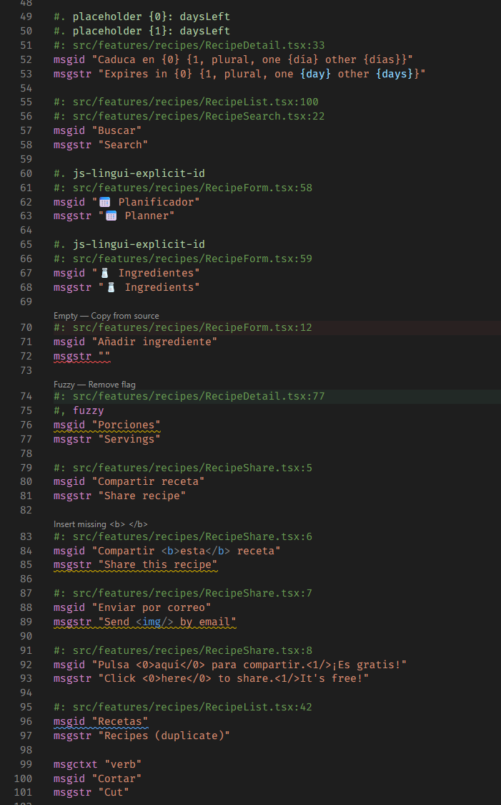

  

<h1 align="center">Gettext Lens</h1>

A lightweight VS Code extension for working with gettext `.po` and `.pot` translation files.

Status bar:

This expension helps catching common mistakes:

- empty translations
- mismatched HTML tags
- fuzzy entries
- duplicate strings
  
And lets you fix them with a single click.

## Features

- **One-click fixes** — clickable buttons appear above entries with issues (like git merge conflicts). Copy source text, remove fuzzy flags, or insert missing HTML tags instantly.
- **Live progress** — a status bar item and inline counter show how much is translated and what's left.
- **Diagnostics** — untranslated strings, fuzzy entries, HTML tag mismatches, and duplicate msgids are highlighted as you type.
- **Syntax highlighting** — full support for gettext syntax including HTML tags, placeholders, and escape sequences.
- **Go-to-source** — Ctrl+click any reference comment to jump to the original source file.

## Getting started

Open any `.po` or `.pot` file — the extension activates automatically. Run **Gettext: Scan Workspace** from the command palette to get a summary across all your translation files.
